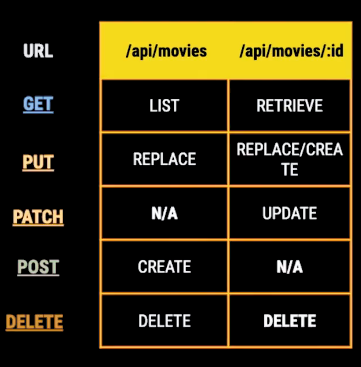

# EJ-Backend_NodeJs

Ejercicios del Curso de backend con nodejs

---

## Instalación

`npm install`

---

## Creacion de Servidor con Express.js

### Instalación de Dependencias

- Para Producción

`npm i express dotenv`

- Para Desarrollo

`npm i -D nodemon eslint eslint-config-prettier eslint-plugin-prettier prettier`

- hooks

`npx mrm lint-staged`

### Ejecución del servidor

En la carpeta 02-movies-api ejecutar comando
`node index.js`

- [El server corre por defecto en el puerto 3000](http://localhost:3000/)
- con otra url [/json](http://localhost:3000/json/)

---

### Anatomía de una API Restful

REST (Representational State Transfer) es un estilo de arquitectura para construir web services, no es un estándar pero si una especificación muy usada.Anatomía de una API Restful
REST (Representational State Transfer) es un estilo de arquitectura para construir web services, no es un estándar pero si una especificación muy usada.

Las [peticiones HTTP](https://developer.mozilla.org/es/docs/Web/HTTP/Methods/POST) van acompañadas de un “verbo” que define el tipo de petición:

- GET. Lectura de datos.
- PUT. Reemplazar datos.
- PATCH. Actualizar datos en un recurso específico.
- POST. Creación de datos.
- DELETE. Eliminación de datos.

_No es recomendable habilitar un endpoint de tipo PUT y DELETE para toda nuestra colección de datos, sólo hacerlos para recursos específicos, ya que no queremos que por error se puedan borrar todos nuestros datos._

---

## Implementacion de un [CRUD](https://platzi.com/clases/1646-backend-nodejs/22030-implementando-un-crud-en-expressjs/)

- [Diagrama de decisión de STATUS Http](https://camo.githubusercontent.com/4e15cccf2a9277dcca2c8824092547dee7058744/68747470733a2f2f7261776769746875622e636f6d2f666f722d4745542f687474702d6465636973696f6e2d6469616772616d2f6d61737465722f6874747064642e706e67)
- [Documentacion de Codigos Http MDN](https://developer.mozilla.org/es/docs/Web/HTTP/Status)
- [Uso de API Cat para los diferentes Estatus](https://http.cat/)

---

## Referencias

- [Creación de Datos aleatorios](https://mockaroo.com/)
- https://github.com/JasanHdz/backendnodejs/tree/master/notes
